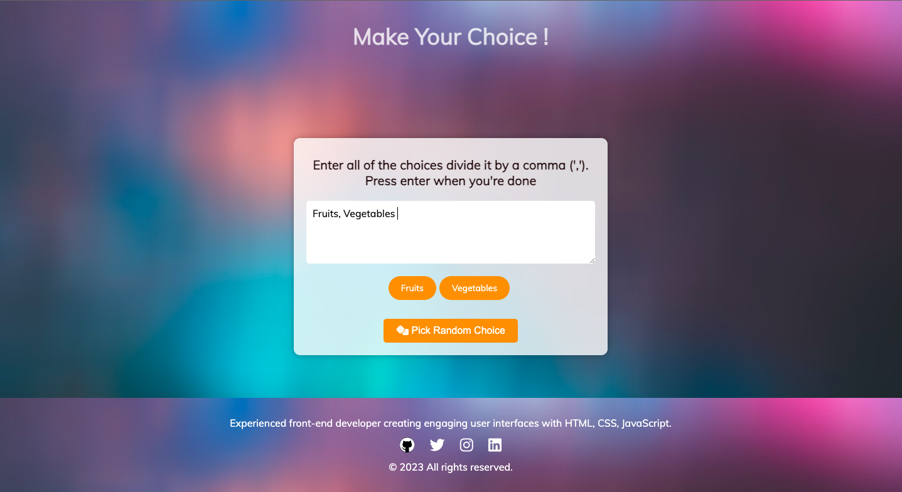

# Choice Picker App

A choice picker app which will help you to make a choice when you are confused.. So what are you waiting for go check out now ⤵️

## Description

The Choice Picker App is a simple web application that helps users make random choices from a list of options. It allows users to enter a list of choices separated by commas and then randomly selects and displays one of the choices when prompted.

## Features

- Input multiple choices separated by commas.
- Randomly pick a choice from the list.
- User-friendly interface.

## Technologies Used

- HTML
- CSS
- JavaScript

## Demo

[Live Demo](https://akashrana18.github.io/Choice-Picker)

## Installation

1. Clone the repository: `git clone https://github.com/AkashRana18/Choice-Picker`
2. Open the `index.html` file in your web browser.

## Usage

1. Open the application in your web browser.
2. Enter your choices in the textarea, separated by commas.
3. Click the "Pick Random Choice" button.
4. The app will randomly select and display one of your choices.

## Screenshots

## Contributing

Contributions are welcome! If you'd like to contribute to this project, please follow these steps:

1. Fork the project.
2. Create your feature branch: `git checkout -b feature/your-feature-name`
3. Commit your changes: `git commit -m 'Add some feature'`
4. Push to the branch: `git push origin feature/your-feature-name`
5. Open a pull request.

## Contact Us

- Akash Rana
- [Email](akashmanu2003@gmail.com)
- [Twitter](https://twitter.com/Akash08_18)
- [LinkedIn](https://www.linkedin.com/in/akashrana18)
- [Instagram](https://www.instagram.com/codewithakash/)

- 

